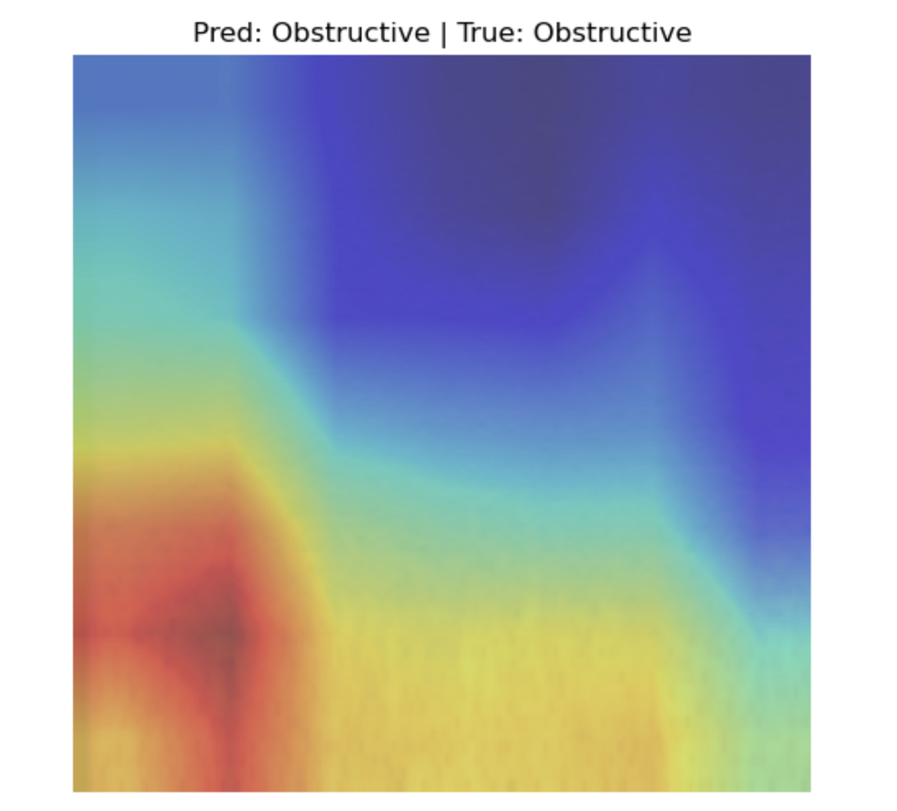

# 🫁 Interpretable AI for Respiratory Sound Diagnosis using CNNs & Grad-CAM++

This repository presents a deep learning pipeline for classifying respiratory conditions (normal, crackles, wheezes) from spectrograms derived from auscultation audio, with built-in **explainability using Grad-CAM++**. Our goal is to bridge the clinical trust gap by making CNN decisions transparent and visually interpretable.

---

## 💡 Project Highlights

- 🎯 **Goal**: Classify abnormal respiratory sounds while providing interpretable visual explanations using **Grad-CAM++**.
- 📊 **Dataset**: [ICBHI 2017 Respiratory Sound Database](https://bhichallenge.med.auth.gr/ICBHI_2017_Challenge)
- 🧠 **Model**: CNN backbone (ResNet-18 or EfficientNet-lite) trained on **Mel-spectrograms**
- 🔍 **XAI Method**: Grad-CAM++ for post hoc explanation of class predictions
- 🔬 **Clinical Relevance**: Heatmaps highlight regions responsible for classification—supporting physicians in diagnostic validation.

---

## 🛠️ Tech Stack

- **Language**: Python  
- **Deep Learning**: PyTorch  
- **Explainability**: Grad-CAM++  
- **Visualization**: Matplotlib, Seaborn  
- **Audio Processing**: LibROSA, Scipy, Wavelet Denoising  
- **Experiment Tracking**: Weights & Biases (wandb)

---

## 🧬 Methodology Overview

### 1. **Audio Preprocessing**
- Applied **wavelet denoising** and **bandpass filtering** to remove ambient noise
- Segmented audio using provided annotations (.txt) from ICBHI dataset
- Converted each segment to a **2D mel-spectrogram**

### 2. **Data Augmentation**
- Pitch shifting, time-stretching, noise injection for generalization

### 3. **Model Training**
- CNN trained on spectrograms with softmax output for multi-class classification: **Normal**, **Crackle**, **Wheeze**, **Combined**
- Evaluation metrics: **Accuracy**, **Precision**, **Recall**, **F1-Score**

### 4. **Explainability with Grad-CAM++**
- Applied Grad-CAM++ to final convolution layers
- Generated **heatmaps** showing the spectrogram regions contributing most to the prediction
- Overlayed explanations onto the spectrograms for intuitive visual interpretation

---

## 🔍 Sample Grad-CAM++ Output

  
  
  
  
  

<b>Predicted: Obstructive | True: Obstructive</b> (all images)

- Red zones indicate areas of highest influence in the CNN’s classification
- Helps clinicians visually validate if the model focused on diagnostically relevant features like **wheezes (narrow frequency bands)** or **crackles (short bursts)**

---

## 🧪 Dataset

**ICBHI 2017 Respiratory Sound Dataset**  
- 920 recordings from 126 patients  
- 6,898 respiratory cycles  
- Labels: **Normal**, **Crackles**, **Wheezes**, **Both**

Data Source: [https://bhichallenge.med.auth.gr/](https://bhichallenge.med.auth.gr/ICBHI_2017_Challenge)

---

---

## ⚠️ Challenges & Risk Mitigation

| Challenge | Mitigation |
|----------|------------|
| Inconsistent spectrograms | Applied fixed time-window slicing + normalization |
| Non-interpretable heatmaps | Filtered low-confidence predictions; documented failure cases |
| GPU limitations | Used lightweight models (ResNet-18); optimized batch size and input dimensions |

---

## 🔚 Conclusion

This project demonstrates that it’s possible to combine **deep learning accuracy** with **clinical interpretability** in respiratory diagnostics. By using **Grad-CAM++**, we show not just **what** the CNN predicted, but also **why**, fostering trust and aiding real-world applicability in healthcare AI.

---

## 👨‍💻 Team

**Alpha Neurons** 
- [@Bsanthoshini1811](https://github.com/Bsanthoshini1811)  
- [@sonalshreya25](https://github.com/sonalshreya25)  
- @sumitsingh
- @nagasoujanyagullapalli

---

## 📜 License

This project is open for academic and research use. Contact us for collaboration or data/model access.

---

## 🔗 Links

- [ICBHI Dataset](https://bhichallenge.med.auth.gr/)
- [Grad-CAM++ Paper](https://openaccess.thecvf.com/content_cvpr_2018/papers/Chattopadhay_Grad-CAM_Visual_Explanations_CVPR_2018_paper.pdf)
- [Weights & Biases](https://wandb.ai/)

